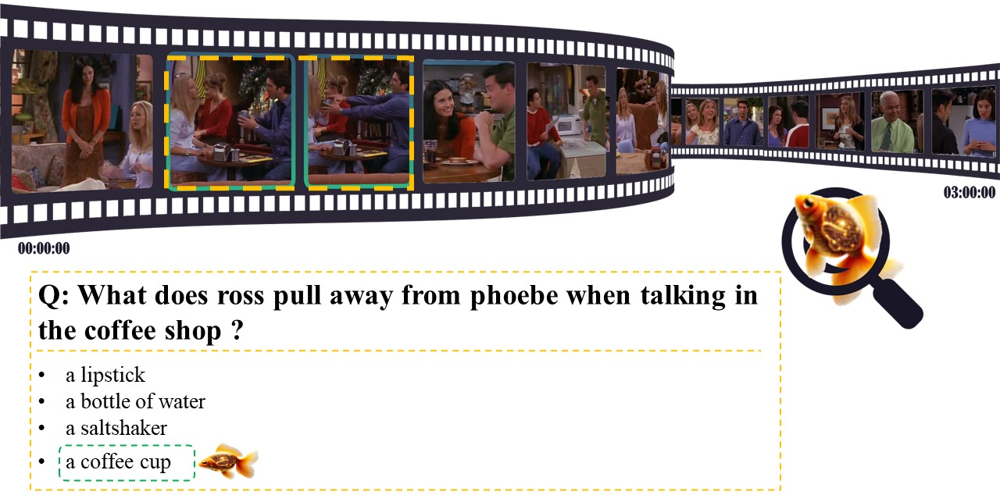
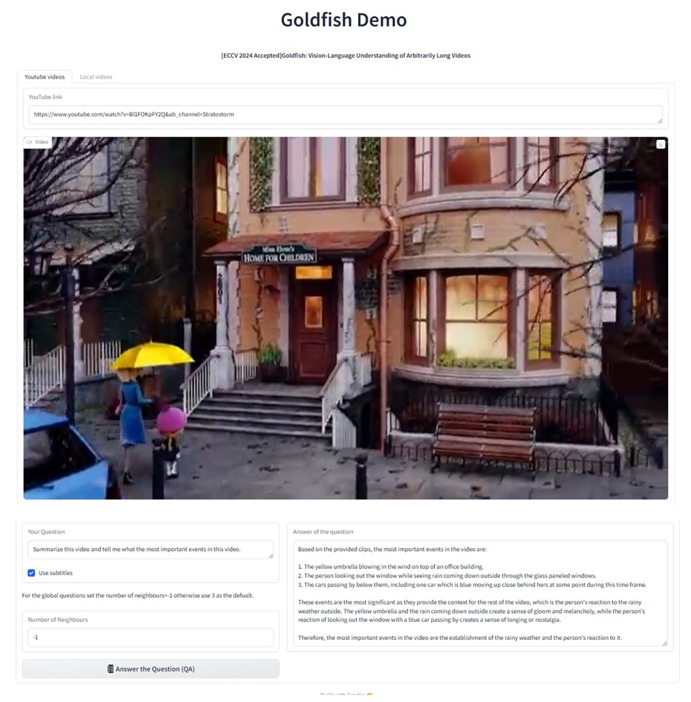
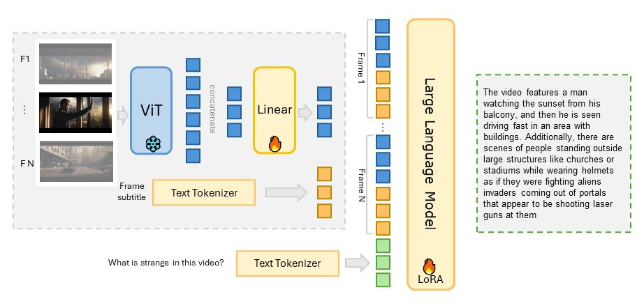
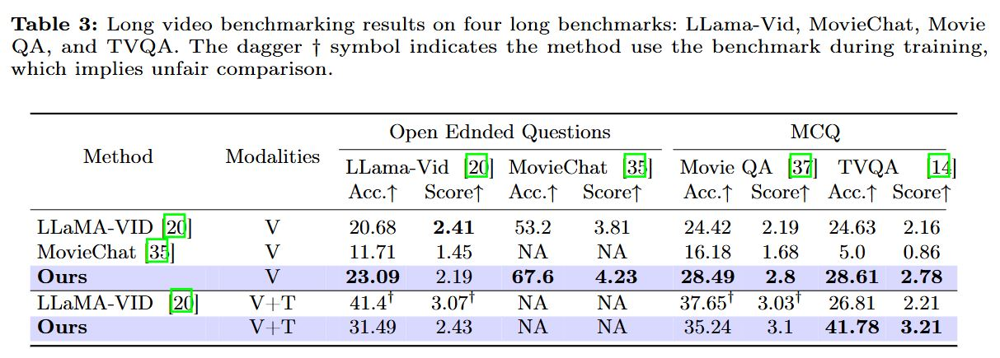

# [ECCV 2024 Accepted]Goldfish: Vision-Language Understanding of Arbitrarily Long Videos
# [CVPR2024 workshop]MiniGPT4-Video: Advancing Multimodal LLMs for Video Understanding with Interleaved Visual-Textual Tokens
**This repo contains the codes for MiniGPT4-video for short video understanding and Goldfish for long video understanding.**
<!-- <h3>Online Demo </h3>
<a href='https://huggingface.co/spaces/Vision-CAIR/MiniGPT4-video'></a>


<font size=3><div> [[🎞️ Project Page]("https://vision-cair.github.io/MiniGPT4-video/")] [[📝 arXiv Paper]("https://arxiv.org/abs/2404.03413")] </div><font>
<h3>Online Demo </h3>
<a href='https://huggingface.co/spaces/Vision-CAIR/MiniGPT4-video'></a>

<font size=3><div> [[ Project Page]()] [[📝 arXiv Paper]()] [[🤗 TVQA-Long Dataset](https://huggingface.co/datasets/Vision-CAIR/TVQA-Long/tree/main)]</div></font> -->

<h3 style="text-align: center;">Online Demos</h3>
<div style="display: flex; justify-content: center; gap: 40px;">
    <div style="text-align: center;">
        <a href='https://a0cf79d5c482838ab8.gradio.live'>
            
        </a>
        <div>
            <font size=3>
                <div>
                    
                    <a href="https://vision-cair.github.io/Goldfish_website/">Project Page</a>
                    <a href="https://arxiv.org/abs/2407.12679">📝 arXiv Paper</a>
                    <a href="https://huggingface.co/datasets/Vision-CAIR/TVQA-Long/tree/main">🤗 TVQA-Long Dataset</a>
                </div>
            </font>
        </div>
    </div>
    <div style="text-align: center;">
        <a href='https://huggingface.co/spaces/Vision-CAIR/MiniGPT4-video'>
            
        </a>
        <div>
            <font size=3>
                <div>
                    <a href="https://vision-cair.github.io/MiniGPT4-video/">🎞️ Project Page</a>
                    <a href="https://arxiv.org/abs/2404.03413">📝 arXiv Paper</a>
                </div>
            </font>
        </div>
    </div>
</div>



## Overview
Most current LLM-based models for video understanding can
process videos within minutes but struggle with processing lengthy videos
due to the “noise and redundancy challenge” and “memory and compu-
tation” challenges. In this paper, we present Goldfish, a methodology
tailored for comprehending videos of arbitrary lengths. We also introduce
the TVQA-long benchmark, specifically designed to evaluate models’
capabilities in understanding long videos with questions in both vision
and text content. Goldfish approaches these challenges with an efficient
retrieval mechanism that initially gathers the top-k video clips relevant to
the instruction before proceeding to provide the desired response. This de-
sign of the retrieval mechanism enables the Goldfish to efficiently process
arbitrarily long video sequences, facilitating its application in contexts
such as movies or television series. To facilitate the retrieval process, we
developed MiniGPT4-Video that generates detailed descriptions for the
video clips. In addressing the scarcity of benchmarks for long video evalu-
ation, we adapted the TVQA short video benchmark for extended content
analysis by aggregating questions from entire episodes, thereby shifting
the evaluation from partial to full episode comprehension. We attained a
41.78% accuracy rate on the TVQA-long benchmark, surpassing previous
methods by 14.94%. Our MiniGPT4-Video also shows exceptional perfor-
mance in short video comprehension, exceeding existing state-of-the-art
methods by 3.23%, 2.03%, 16.5% and 23.59% on the MSVD, MSRVTT,
TGIF,and TVQA short video benchmarks, respectively. These results
indicate that our models have significant improvements in both long and
short-video understanding.
### Goldfish framework (Long videos)
<br>

### MiniGPT4-Video  (Short videos)


[](https://paperswithcode.com/sota/zeroshot-video-question-answer-on-tgif-qa?p=minigpt4-video-advancing-multimodal-llms-for)

[](https://paperswithcode.com/sota/zero-shot-video-question-answer-on-tvqa?p=minigpt4-video-advancing-multimodal-llms-for)

[](https://paperswithcode.com/sota/video-based-generative-performance-1?p=minigpt4-video-advancing-multimodal-llms-for)

[](https://paperswithcode.com/sota/video-based-generative-performance-3?p=minigpt4-video-advancing-multimodal-llms-for)

[](https://paperswithcode.com/sota/video-based-generative-performance-4?p=minigpt4-video-advancing-multimodal-llms-for)

[](https://paperswithcode.com/sota/video-based-generative-performance-5?p=minigpt4-video-advancing-multimodal-llms-for)

[](https://paperswithcode.com/sota/video-based-generative-performance-2?p=minigpt4-video-advancing-multimodal-llms-for)

[](https://paperswithcode.com/sota/zeroshot-video-question-answer-on-msvd-qa?p=minigpt4-video-advancing-multimodal-llms-for)

[](https://paperswithcode.com/sota/zeroshot-video-question-answer-on-msrvtt-qa?p=minigpt4-video-advancing-multimodal-llms-for)

[](https://paperswithcode.com/sota/zeroshot-video-question-answer-on-activitynet?p=minigpt4-video-advancing-multimodal-llms-for)


 
## :rocket: Demo
**1. Clone the repository** <br>
```bash
git clone https://github.com/Vision-CAIR/MiniGPT4-video.git
cd MiniGPT4-video
```

**2. Set up the environment** <br>
```bash
conda env create -f environment.yml
```
**3. Download the checkpoints**

| MiniGPT4-Video (Llama2 Chat 7B) | MiniGPT4-Video (Mistral 7B) |
:------------------------------------------------------------------------------------------------:|:----------------------------------------------------------------------------------------------:
| [Download](https://huggingface.co/Vision-CAIR/MiniGPT4-Video/blob/main/checkpoints/video_llama_checkpoint_last.pth) | [Download](https://huggingface.co/Vision-CAIR/MiniGPT4-Video/blob/main/checkpoints/video_mistral_checkpoint_last.pth) |

**4. Run the demo** <br>
Goldfish demo 
```bash
# For recommended performance, add the parameter --use_openai_embedding True to the command below and set the API key in the environment variable OPENAI_API_KEY otherwise the model will use the default embeddings.
export OPENAI_API_KEY="your_openai_key" 
# Llama2
python goldfish_demo.py --ckpt path_to_video_checkpoint --cfg-path test_configs/llama2_test_config.yaml 
# Mistral
python goldfish_demo.py --ckpt path_to_video_checkpoint --cfg-path test_configs/mistral_test_config.yaml
```
MiniGPT4-Video demo
```bash
# Llama2
python minigpt4_video_demo.py --ckpt path_to_video_checkpoint --cfg-path test_configs/llama2_test_config.yaml
# Mistral
python minigpt4_video_demo.py --ckpt path_to_video_checkpoint --cfg-path test_configs/mistral_test_config.yaml
```
### Inference
Do the previous steps and replace step 4 with this step <br>
Goldfish inference
```bash
# For recommended performance, add the parameter --use_openai_embedding True to the command below and set the API key in the environment variable OPENAI_API_KEY otherwise the model will use the default embeddings.
export OPENAI_API_KEY="your_openai_key" 
# Llama2
python goldfish_inference.py --ckpt path_to_llama2_checkpoint --cfg-path test_configs/llama2_test_config.yaml --video_path path_to_video --question "Your question here" 
# Mistral
python goldfish_inference.py --ckpt path_to_mistral_checkpoint --cfg-path test_configs/mistral_test_config.yaml --video_path path_to_video --question "Your question here" 
```
MiniGPT4-Video inference
```bash
# Llama2
python minigpt4_video_inference.py --ckpt path_to_llama2_checkpoint --cfg-path test_configs/llama2_test_config.yaml --video_path path_to_video --question "Your question here" 
# Mistral
python minigpt4_video_inference.py --ckpt path_to_mistral_checkpoint --cfg-path test_configs/mistral_test_config.yaml --video_path path_to_video --question "Your question here" 
```
## :fire: Training
For both Goldfish and MiniGPT4-Video, the only training part is the MiniGPT4-Video model. <br>
### To customize MiniGPT4-Video for your own Video-text dataset 
<!-- point to file here Custom_training.md -->
You can find the steps to customize MiniGPT4-Video for your own video-text dataset in [Custom_training.md](Custom_training.md)
### Training datasets
After downloading the datasets below, **you should go to the datasets configuration folder here minigpt4/configs/datasets set the paths for each dataset there.**<br>
Image text training<br>
You can find the steps to download the datasets in [MiniGPT4](https://github.com/Vision-CAIR/MiniGPT-4/tree/main/dataset)<br>
+ LAION <br>
+ Conceptual Captions <br>
+ SBU <br>

Video text training:<br>

+ [CMD](https://www.robots.ox.ac.uk/~vgg/data/condensed-movies/) <br>
+ [Webvid](https://github.com/m-bain/webvid/) <br> <!-- + [Webvid](https://huggingface.co/datasets/TempoFunk/webvid-10M?row=2) <br> -->
+ [Video Instructional Dataset 100K](https://huggingface.co/datasets/MBZUAI/VideoInstruct-100K) <br>

You can find the datasets annotation files for video_text datasets here [download](https://huggingface.co/Vision-CAIR/MiniGPT4-Video/tree/main/datasets/training_datasets) <br>


### Model training: 
You can edit the number of gpus in the each script.sh below<br>
#### Stage 1 (image text pretraining)

You can directly download the pretrained MiniGPT4 [checkpoint](https://drive.google.com/file/d/11nAPjEok8eAGGEG1N2vXo3kBLCg0WgUk/view?usp=sharing) aligned with Llama2. <br>

Or train by yourself:

```bash
# pretrain
# Llama2
torchrun --nproc-per-node NUM_GPU train.py --cfg-path train_configs/224_minigpt4_llama2_image.yaml
# Mistral
torchrun --nproc-per-node NUM_GPU train.py --cfg-path train_configs/224_minigpt4_mistral_image.yaml

# align
# To launch the second stage alignment, first specify the path to the checkpoint file trained in pretrain stage.
# Llama2
torchrun --nproc-per-node NUM_GPU train.py --cfg-path train_configs/224_minigpt4_llama2_image_align.yaml
# Mistral
torchrun --nproc-per-node NUM_GPU train.py --cfg-path train_configs/224_minigpt4_mistral_image_align.yaml
```
You can download our trained weights for this stage from here [Llama2](https://huggingface.co/Vision-CAIR/MiniGPT4-Video/blob/main/checkpoints/image_llama2_checkpoint.pth) [Mistral](https://huggingface.co/Vision-CAIR/MiniGPT4-Video/blob/main/checkpoints/image_mistral_checkpoint.pth)<br>
#### Stage 2 (video captioning pretraining)

For **Llama2** <br>
set the cfg-path in the script to `train_configs/224_v2_llama2_video_stage_2.yaml` <br>
set the model name here `minigpt4/configs/datasets/cmd_video/default.yaml` and `minigpt4/configs/datasets/webvid/default.yaml` to llama2<br>
For **Mistral**<br> 
set the cfg-path in the script to `train_configs/224_v2_mistral_video_stage_2.yaml` <br>
set the model name here `minigpt4/configs/datasets/cmd_video/default.yaml` and `minigpt4/configs/datasets/webvid/default.yaml` to mistral<br>

```bash
bash jobs_video/train/stage_2.sh
```
You can download our trained weights for this stage from here [Llama2](https://huggingface.co/Vision-CAIR/MiniGPT4-Video/blob/main/checkpoints/video_captioning_llama_checkpoint_last.pth) [Mistral](https://huggingface.co/Vision-CAIR/MiniGPT4-Video/blob/main/checkpoints/video_captioning_mistral_checkpoint_last.pth)<br>

#### Stage 3 (video Instruction finetuning)

For **Llama2** <br>
set the cfg-path in the script to `train_configs/224_v2_llama2_video_stage_3.yaml` <br>
set the model name here `minigpt4/configs/datasets/video_chatgpt/default.yaml` to llama2<br>

For **Mistral**<br> 
set the cfg-path in the script to `train_configs/224_v2_mistral_video_stage_3.yaml` <br>
set the model name here `minigpt4/configs/datasets/video_chatgpt/default.yaml` to mistral<br>

```bash
bash jobs_video/train/stage_3.sh
```
You can download our trained weights for this stage from here [Llama2](https://huggingface.co/Vision-CAIR/MiniGPT4-Video/blob/main/checkpoints/video_llama_checkpoint_last.pth) [Mistral](https://huggingface.co/Vision-CAIR/MiniGPT4-Video/blob/main/checkpoints/video_mistral_checkpoint_last.pth)<br>

## :zap: MiniGPT4-Video Evaluation
To reproduce the results use the best checkpoints for each model <br>
[Llama2](https://huggingface.co/Vision-CAIR/MiniGPT4-Video/blob/main/checkpoints/video_llama_checkpoint_best.pth) [Mistral](https://huggingface.co/Vision-CAIR/MiniGPT4-Video/blob/main/checkpoints/video_mistral_checkpoint_best.pth)<br>
We used the same evaluation as [Video-ChatGPT](https://mbzuai-oryx.github.io/Video-ChatGPT/)<br>

|Method| Using Subtitles | Information Correctness | Detailed Orientation | Contextual Understanding | Temporal Understanding | Consistency |
|:--------------------:|:----:|:------------------------:|:---------------------:|:-------------------------:|:-----------------------:|:------------:|
| LLaMA Adapter | :x:| 2.03 | 2.32| 2.30| 1.98| 2.15 |
| Video LLaMA| :x:| 1.96 | 2.18| 2.16| 1.82| 1.79 |
| Video Chat| :x:| 2.23 | 2.50| 2.53| 1.94| 2.24 |
| Video-ChatGPT | :x:| 2.40 | 2.52| 2.62| 1.98| 2.37 |
| BT-Adapter-7B | :x:| 2.68 | 2.69| 3.27| 2.34| 2.46 |
| LLaMA-VID-7B| :x:| 2.96 | 3.00| 3.53| 2.46| 2.51 |
| **Ours-7B Llama2**| :x:| 2.93 | 2.97| 3.45| **2.47**| **2.60**|
| **Ours-7B Llama2**| :white_check_mark:| **3.08** | **3.02**| **3.57**| **2.65**| **2.67**|
| **Ours-7B Mistral** | :x:| 2.83|2.52 |3.01 |2.32 |2.40 |
| **Ours-7B Mistral**| :white_check_mark:| 2.91 | 2.57| 3.11|2.33 | 2.39|


|Method| Using Subtitles | MSVD Acc.↑ | MSVD Score↑ | MSRVTT Acc.↑ | MSRVTT Score↑ | TGIF Acc.↑ | TGIF Score↑ | ActivityNet Acc.↑ | ActivityNet Score↑ | TVQA Acc.↑ |
|:---------------------------------------:|:----------------:|:-----------:|:------------:|:--------------:|:---------------:|:-----------:|:------------:|:-------------------:|:--------------------:|:------------:|
| FrozenBiLM|:x:|32.2| --|16.8 |--| 41 |-- |24.7|--|29.7 |
| LLaMA Adapter|:x:|54.9| 3.1 |43.8 |2.7| -- |-- |34.2| 2.7| --|
| Video LLaMA|:x:|51.6| 2.5 |29|1.8| -- |-- |12.4| 1.1| --|
| Video Chat|:x:|56.3| 2.8 |45|2.5|34.4| 2.3 |26.5| 2.2|--|
| Video-ChatGPT|:x:|64.9| 3.3 |49.3 |2.8|51.4| 3.0 |35.2| 2.7|23.35|
| BT-Adapter-7B|:x:|67.7| 3.7 |57|3.2| -- |-- |45.7| 3.2| --|
| LLaMA-VID-7B |:x:|69.7| 3.7 |57.7 |3.2| -- |-- |**47.4**| **3.3**| --|
| **Ours-7B LLama2**|:x:|72.93|3.84|58.83|3.29|67.9|3.71| 45.85 |3.23|36.45|
| **Ours-7B Llama2**|:white_check_mark:|72.93|3.84|**59.73**|**3.3** |67.9|3.71| 46.3|3.4 |46.94|
| **Ours-7B Mistral**|:x:|**73.92**|**4.06**|58.26|3.52|**72.22**|**4.08**|44.25 |3.35|33.90|
| **Ours-7B Mistral**|:white_check_mark:|**73.92**|**4.06**|58.68|3.53 |**72.22**|**4.08**| 44.38|3.36 |**54.21** |

### Download datasets for evaluation
+ [MSVD](https://www.cs.utexas.edu/users/ml/clamp/videoDescription/) <br>
+ [MSRVTT](https://cove.thecvf.com/datasets/839) <br>
+ [TGIF](https://github.com/YunseokJANG/tgif-qa/blob/master/dataset/README.md) <br>
+ [ActivityNet](https://mbzuaiac-my.sharepoint.com/:u:/g/personal/hanoona_bangalath_mbzuai_ac_ae/ESa302OCJMNHsMk7wuBbQc8BZH5CqlcdCWiSpXynQZDfAQ?e=CrOPbm) <br>
+ [TVQA](https://tvqa.cs.unc.edu/) <br>
+ [Video-ChatGPT benchmark](https://mbzuai-oryx.github.io/Video-ChatGPT/) <br>

You can find the evaluation datasets annotation files [download](https://huggingface.co/Vision-CAIR/MiniGPT4-Video/tree/main/datasets/evaluation_datasets) <br>

### Run evaluation script
Set the each evaluation script parameters to include the path to the checkpoints, the dataset name and whether to use subtitles or not <br> 

```bash
# Llama2
bash jobs_video/eval/llama2_evaluation.sh
# Mistral
bash jobs_video/eval/mistral_evalualtion.sh
```
Then Use GPT3.5 turbo to compare the predictions with the ground truth and generate the accuracy and scores <br>
Set these variables in both evaluate_benchmark.sh and evaluate_zeroshot.sh <br>
```bash
PRED="path_to_predictions"
OUTPUT_DIR="path_to_output_dir"
API_KEY="openAI_key"
NUM_TASKS=128
```
Then to evaluate [Video-ChatGPT benchmark] run the following script <br>
```bash
bash test_benchmark/quantitative_evaluation/evaluate_benchmark.sh
```
To evaluate open ended questions run the following script <br>
```bash
bash test_benchmark/quantitative_evaluation/evaluate_zeroshot.sh
```

## :zap: Goldfish Evaluation
**Long video benchmarking results on four benchmarks: LLama-Vid, MovieChat, Movie QA, and our proposed TVQA-Long. The "V" modality indicates the use of video frames only, while "V+T" indicates the use of both video frames and subtitles**

<!--  -->
| Method      | Modalities | LLama-Vid Acc.↑ | LLama-Vid Score↑ | MovieChat Acc.↑ | MovieChat Score↑ | Movie QA Acc.↑ | Movie QA Score↑ | TVQA-Long Acc.↑ | TVQA-Long Score↑ |
|-------------|------------|-----------------|------------------|-----------------|------------------|----------------|-----------------|------------|-------------|
| LLAMA-VID   | V          | 20.68           | 2.41             | 53.2            | 3.81             | 24.42          | 2.19            | 24.63      | 2.16        |
| MovieChat   | V          | 11.71           | 1.45             | NA              | NA               | 16.18          | 1.68            | 5.0        | 0.86        |
| Ours        | V          | **23.09**       | 2.19             | **67.6**        | **4.23**         | **28.49**      | **2.8**         | **28.61**  | **2.78**    |
| LLAMA-VID   | V+T        | 41.4†           | 3.07†            | NA              | NA               | 37.65†         | 3.03†           | 26.86      | 2.21        |
| Ours        | V+T        | 31.49           | 2.48             | NA              | NA               | 35.24          | **3.1**             | **41.78**  | **3.21**    |

**Note: The dagger † symbol indicates the method used the benchmark during training, which implies unfair comparison.**

To reproduce the results use the `checkpoints/video_llama_checkpoint_last.pth`  and use openAI embedding `--use_openai_embedding=True`<br>
### Download datasets for evaluation
For **Llama-vid** and **MovieQA** <br>
Dowlnoad the original MovieNet data with movies and annotations from [here](https://opendatalab.com/OpenDataLab/MovieNet/tree/main/raw)<br>
This will be the souce videos for LLama-vid and MovieQA <br>
#### Filtered Annotations same as illestrated in the paper and used for evaluation
[Llama-vid](https://huggingface.co/Vision-CAIR/MiniGPT4-Video/tree/main/datasets/goldfish_eval_datasets/llama_vid)<br>
[MovieQA](https://huggingface.co/Vision-CAIR/MiniGPT4-Video/tree/main/datasets/goldfish_eval_datasets/movie_qa)<br>
For **Moviechat** the only available videos while implementing this work is 10 % of the training data and this what we used for evalaution and can be found [here](https://huggingface.co/Vision-CAIR/MiniGPT4-Video/blob/main/datasets/goldfish_eval_datasets/movie_chat/available_movies_list.txt) <br>
Full dataset can be found [here](https://huggingface.co/datasets/Enxin/MovieChat-1K_train/tree/main) <br>
For **TVQA-Long** <br>
Both videos and annotations can be found here [TVQA-Long](https://huggingface.co/datasets/Vision-CAIR/TVQA-Long/tree/main)
### Run the evaluation scripts 
``` bash 
# Llama-vid evalauation 
# set these parameters in the script 
videos_path="path to the videos"
subtitle_path="path to the subtitles"
video_clips_saving_path="path to save the video clips"
annotation_file="path to the annotation file"
movienet_annotations_dir="path to the movienet annotations directory" 
NEIGHBOURS=3
use_openai_embedding="whether to use openai embeddings or not"
# then run the script
bash jobs_video/long_video_eval/movies/eval_model_summary_llama_vid.sh

# MovieQA evaluation
# same as above but set the parameters in the script to the MovieQA paths 
bash jobs_video/long_video_eval/movies/eval_model_summary_movie_qa.sh

# MovieChat evaluation 
# set these parameters in the script 
dataset_path="path to the movies folder"
annotation_json_folder="path to the jsons folder"
# then run the script
bash jobs_video/long_video_eval/movies/eval_model_summary_movie_chat.sh
```
### TVQA-Long
For Goldfish evaluation we can use the original separated clips from the original TVQA dataset <br>
Download the original TVQA videos for short videos from [here](https://tvqa.cs.unc.edu/download_tvqa.html)<br>
```bash 
# set these parameters in the script
tvqa_json_subtitles="path to the tvqa json subtitles file"
tvqa_clips_subtitles="path to the tvqa clips subtitles"
videos_frames="path to the video frames"
annotation_path="path to the TVQA-Long annotation file"
NEIGHBOURS= 3
use_openai_embedding="whether to use openai embeddings or not"
# then run the script
bash jobs_video/long_video_eval/tvqa_eval/eval_model_summary.sh
````

Then Use GPT3.5 turbo to compare the predictions with the ground truth and generate the accuracy and scores <br>
Set these variables in evaluate_zeroshot.sh <br>
```bash
PRED="path_to_predictions"
OUTPUT_DIR="path_to_output_dir"
API_KEY="openAI_key"
NUM_TASKS=128
```
To evaluate open ended questions run the following script <br>
```bash
bash test_benchmark/quantitative_evaluation/evaluate_zeroshot.sh
```

## Citation
If you're using MiniGPT4-Video or Goldfish in your research or applications, please cite using this BibTeX:
```
@misc{ataallah2024goldfishvisionlanguageunderstandingarbitrarily,
      title={Goldfish: Vision-Language Understanding of Arbitrarily Long Videos}, 
      author={Kirolos Ataallah and Xiaoqian Shen and Eslam Abdelrahman and Essam Sleiman and Mingchen Zhuge and Jian Ding and Deyao Zhu and Jürgen Schmidhuber and Mohamed Elhoseiny},
      year={2024},
      eprint={2407.12679},
      archivePrefix={arXiv},
      primaryClass={cs.CV},
      url={https://arxiv.org/abs/2407.12679}, 
}
@article{ataallah2024minigpt4,
  title={MiniGPT4-Video: Advancing Multimodal LLMs for Video Understanding with Interleaved Visual-Textual Tokens},
  author={Ataallah, Kirolos and Shen, Xiaoqian and Abdelrahman, Eslam and Sleiman, Essam and Zhu, Deyao and Ding, Jian and Elhoseiny, Mohamed},
  journal={arXiv preprint arXiv:2404.03413},
  year={2024}
}

```

## Acknowledgements
[MiniGPT4](https://github.com/Vision-CAIR/MiniGPT-4) <br>
[Video-ChatGPT](https://mbzuai-oryx.github.io/Video-ChatGPT)

## License
This repository is under [BSD 3-Clause License](LICENSE.md).
Many codes are based on [MiniGPT4](https://github.com/Vision-CAIR/MiniGPT-4).
